# Alertify Android 

## This fork of Gotify Android adds Spoofing of WEA Messages at the API 29 UI level

## Gotify Android 


Gotify Android connects to [gotify/server](https://github.com/gotify/server) and shows push notifications on new messages.

## Sening an spoofed alert

### Priority
- \>89 - WEA dialog without Audio
- \>99 - WEA dialog with Audio *Note it uses the Alarm channel and sets to full it will override Do not disturb*

### Title options

The title field i9s used to send the message type, Types are as follows:

*Note, if title is absent or dosent match it defaults to "Critical Alert"*
*Title is case insesitive*

#### CMAS Alerts
- President
- Extreme
- Severe
- Amber
- Public
- RMT
- Broadcast
- StateTest

#### ETWS Alerts
- Tsunami
- Earthquake
- ET *(ETWS Earthquake & Tsunami Message)*
- ETWS*(ETWS Other Message)*
- ETWSTest


#### Example Commands

Example CMAS Presidental alert 
> curl "https:/\/\<gotifyURL\>/message?token=_" -F "title=President" -F "message=This is the body" -F "priority=105"

Example CMAS Extreme alert muted
> curl "https:/\/\<gotifyURL\>/message?token=_" -F "title=Extreme" -F "message=This is the body" -F "priority=95"

Example ETWS Tsunami alert 
> curl "https:/\/\<gotifyURL\>/message?token=_" -F "title=Tsunami" -F "message=This is the body" -F "priority=105"

#### CMAS Examples

    > CMAS Presidental Message    

          


    > CMAS Extreme Message

    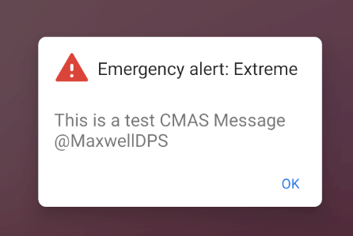


    > CMAS Severe Message

    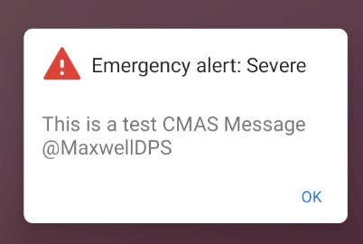


    > CMAS Amber Alert / Child Abduction Message

    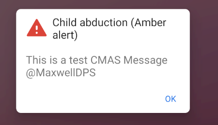


    > CMAS Public Safety Message

    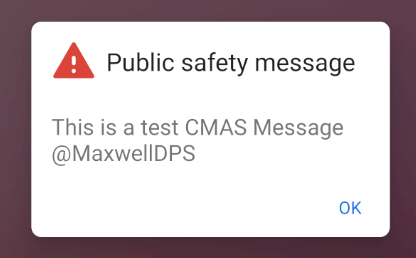

    > CMAS Required Monthly Test Message

    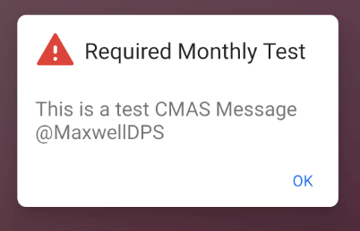

    > CMAS State/Local Test Message 

    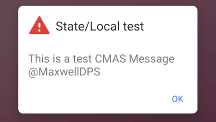

    > Emergency Broadcast Operator Message

    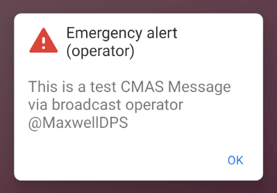


#### ETWS Examples

     > ETWS Tsunami Message

     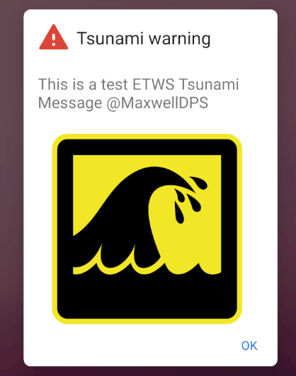

     > ETWS Earthquake Message

     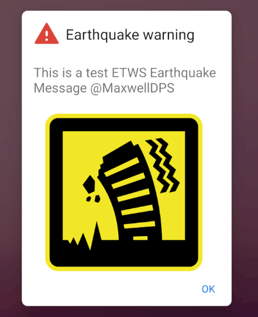
     
     > ETWS Earthquake & Tsunami Message

     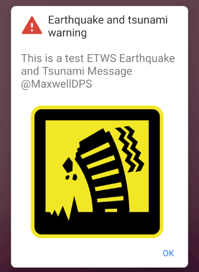

    > ETWS Other Message

    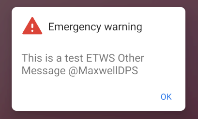

    > ETWS Test Message

    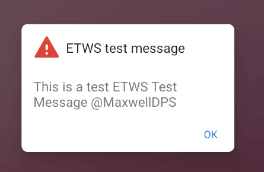


                      
                     


## Features

* show push notifications on new messages
* view and delete messages

## Installation

Download the apk or build via Android studio.

### Disable battery optimization

By default Android kills long running apps as they drain the battery. With enabled battery optimization, Gotify will be killed and you wont receive any notifications.

Here is one way to disable battery optimization for Gotify.

* Open "Settings"
* Search for "Battery Optimization"
* Find "Gotify" and disable battery optimization

### Minimize the Gotify foreground notification

*Only possible for Android version >= 8*

The foreground notification with content like `Listening to https://push.yourdomain.eu` can be manually minimized to be less intrusive:

* Open Settings -> Apps -> Gotify
* Click Notifications
* Click on `Gotify foreground notification`
* Select a different "Behavior" or "Importance" (depends on your android version)
* Restart Gotify

## Message Priorities

| Notification | Gotify Priority|
|- |-|
| - | 0 |
| Icon in notification bar | 1 - 3 |
| Icon in notification bar + Sound | 4 - 7 |
| Icon in notification bar + Sound + Vibration | 8 - 10 |

## Building

Execute the following command to build the apk.
```bash
$ ./gradlew build
```

## Update client

* Run `./gradlew generateSwaggerCode`
* Discard changes to `client/build.gradle` (newer versions of dependencies)
* Fix compile error in `client/src/main/java/com/github/gotify/client/auth/OAuthOkHttpClient.java` (caused by an updated dependency)
* Delete `client/settings.gradle` (client is a gradle sub project and must not have a settings.gradle)
* Commit changes

## Versioning
We use [SemVer](http://semver.org/) for versioning. For the versions available, see the
[tags on this repository](https://github.com/gotify/android/tags).

## License
This project is licensed under the MIT License - see the [LICENSE](LICENSE) file for details

